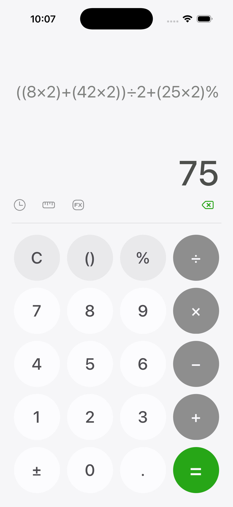
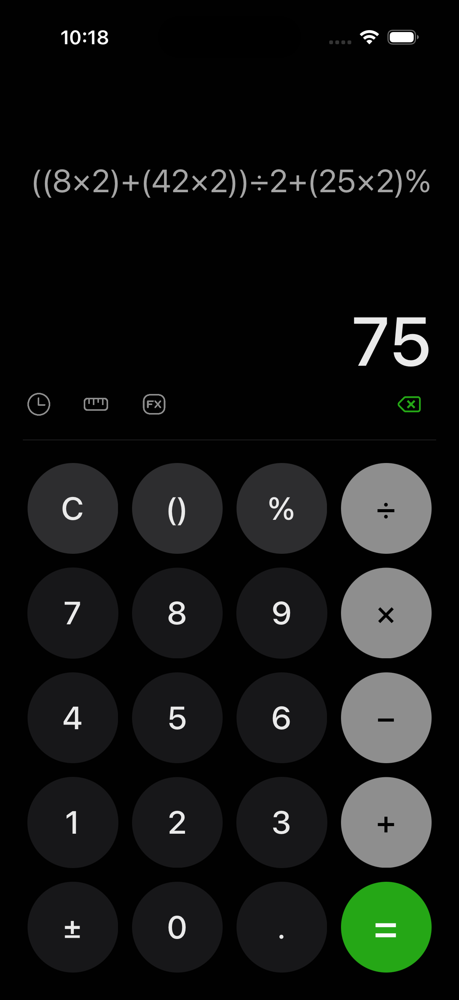

# Calculator - SwiftUI Edition

A modern, robust, and beautiful calculator app built with SwiftUI, inspired by the Samsung Calculator design. This project was developed as part of a learning journey to master advanced SwiftUI layouts and complex expression evaluation logic.

## 🚀 Features

- **Samsung-Inspired Design**: A clean, premium UI with circular buttons and a refined color palette.
- **Smart Expression Evaluation**: Uses `JSContext` to solve complex mathematical equations in real-time.
- **Advanced Bracket Support**: A smart bracket button (`()`) that handles multiple levels of nesting and automatic closing.
- **Context-Aware Percentages**: Implements intuitive percentage logic (e.g., `100 + 10% = 110`) instead of raw mathematics.
- **Dynamic Icons**: Uses high-quality SVGs for History, Unit Conversion (Ruler), and Scientific Functions.
- **Adaptive Layout**: Fully responsive design using `GeometryReader`, optimized for all iOS screen sizes.
- **Dark & Light Mode Support**: Beautifully themed for both operating system color schemes.

## 📸 Preview

| Light Mode | Dark Mode |
|:---:|:---:|
|  |  |

## 🛠️ Technical Implementation

- **Core Framework**: SwiftUI
- **Evaluation Engine**: JavaScriptCore (`JSContext`)
- **State Management**: `@State` and `@StateObject` patterns
- **Asset Organization**: Structured `Assets.xcassets` with comprehensive `ColorSet` and `ImageSet` (Icons).
- **Modern APIs**: Uses the latest SwiftUI modifiers and avoids deprecated `UIScreen.main` APIs for future-proofing.

## 🎓 What I Learned

During this project, I significantly expanded my iOS development skillset:

1.  **Sophisticated SwiftUI Layouts**: Mastering `GeometryReader` and stacks to achieve perfect circular button layouts and responsive spacing.
2.  **Expression Sanitization**: Developing robust logic to transform UI-friendly input (×, ÷, −, %) into standard mathematical notation.
3.  **Contextual Logic Implementation**: Programming the app to distinguish between raw percentage calculation and total-relative percentage adjustment (e.g., `A + B%`).
4.  **Edge Case Handling**: Managing complex nested brackets and "smart" UI feedback (like alerts for non-functional buttons).
5.  **Professional Documentation**: Learning how to utilize AI assistance (`Antigravity`) to refine logic and document technical progress.
6.  **Asset Workflows**: Integrating SVG assets and custom color tokens for a professional design finish.

## 📚 Credits & Inspiration

- **Tutorial**: Initial foundation set by watching [this tutorial](https://www.youtube.com/watch?v=cMde7jhQlZI).
- **Design**: Re-imagined and custom-designed based on modern One UI principles.
- **Icons**: Icons sourced and refined from professional SVG repositories.
- **AI Pairing**: Developed in partnership with **Antigravity**, an AI Pair Programmer.

---
Built with ❤️ and Antigravity.
